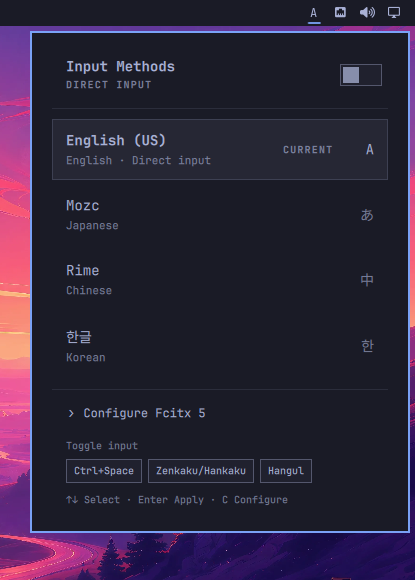
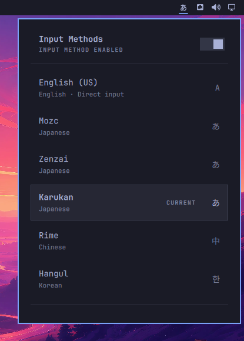

# Omarchy Input Methods

An Omarchy bar widget for the input methods already configured in Fcitx 5. It shows the current input method, opens a keyboard-accessible switcher, displays the configured trigger keys, and launches the Fcitx configuration tool.

The list comes from the active Fcitx group rather than a hardcoded language list. Mozc, Hazkey, Rime, Hangul, and future engines can therefore share the same interface.



The screenshot was captured in a disposable `en_US.UTF-8` Omarchy VM with Japanese, Chinese, and Korean input engines configured in the same Fcitx group.

Long-name layout check (Karukan and Zenzai), using display-only fixture data in
the same VM rather than real conversion engines:



This plugin manages switching and visibility. Installing input engines and making them available immediately after a fresh Omarchy installation are separate setup concerns.

## Requirements

- Omarchy Quattro
- Fcitx 5
- `busctl` and `jq` (included with Omarchy)
- `fcitx5-configtool` for the Configure button

## Install

```bash
omarchy plugin add https://github.com/komagata/omarchy-input-method.git
omarchy plugin enable komagata.input-method
```

## Use

- Left-click the bar label to open the input-method list.
- Right-click the bar label to toggle Fcitx.
- Use Up/Down and Enter in the panel to select an input method.
- Press `C` in the panel to open Fcitx configuration.

The bar and panel use the same language symbol: Japanese `あ`, Chinese `中`,
Korean `한`, English `A`, Russian `Я`, Arabic `ع`, and Thai `ก`.
Other languages use their two- or three-letter language code; missing or invalid
language information displays `?`. Full engine names remain in the panel and
tooltip. These symbols identify the input language, not the current conversion
mode (such as hiragana versus Latin input).

## Remove

```bash
omarchy plugin remove komagata.input-method
```

## Development

```bash
./test/run
omarchy plugin validate .
qmllint -I "$OMARCHY_PATH/shell" ./*.qml
```

## Prior art

This project was informed by [Praveensenpai/omarchy-japanese-ime](https://github.com/Praveensenpai/omarchy-japanese-ime), [eric8810/omarchy-input-method](https://github.com/eric8810/omarchy-input-method), and [ddload87/omarchy-input-method](https://github.com/ddload87/omarchy-input-method). It uses a separate implementation and a namespaced plugin ID so it can coexist with earlier plugins.

## License

MIT
